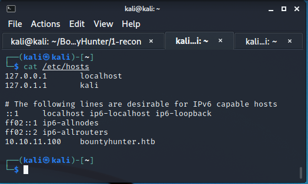
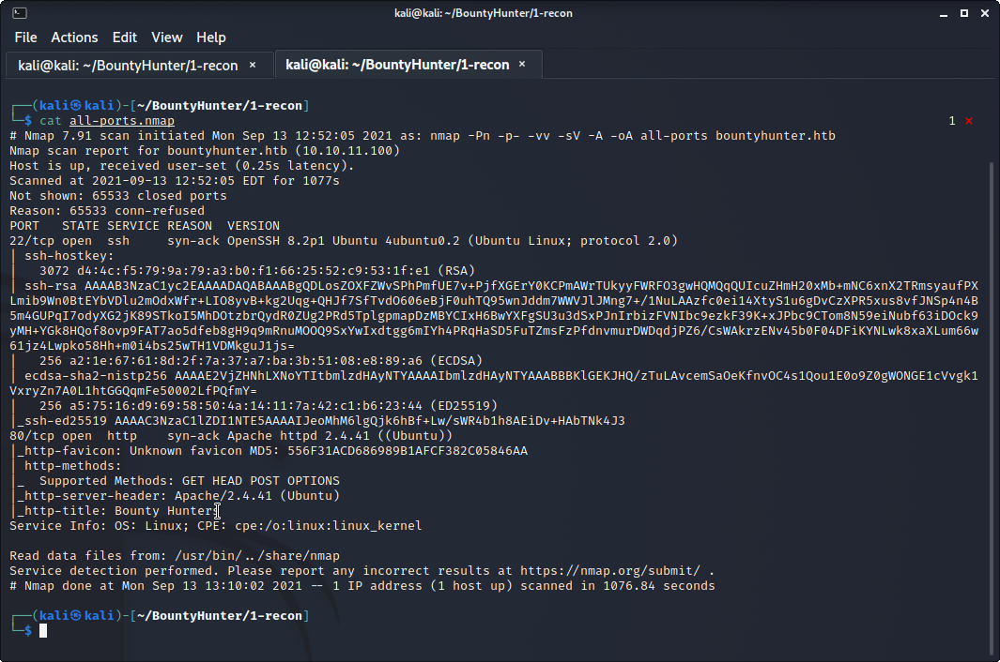
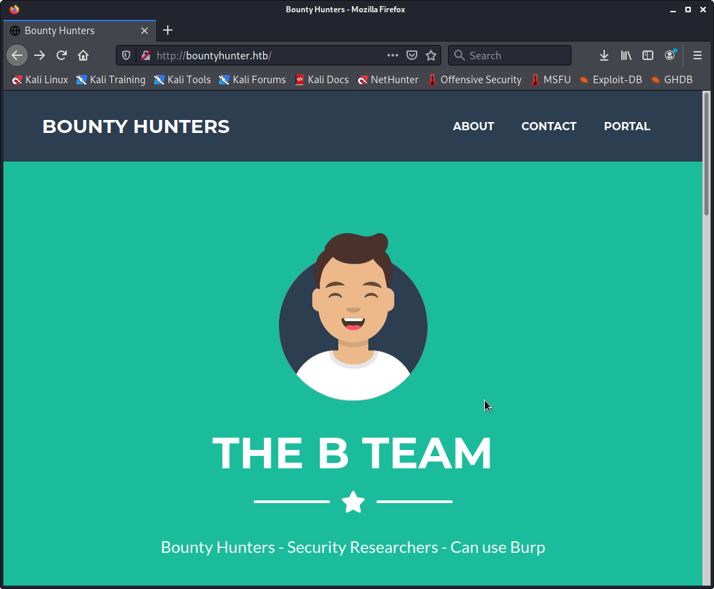
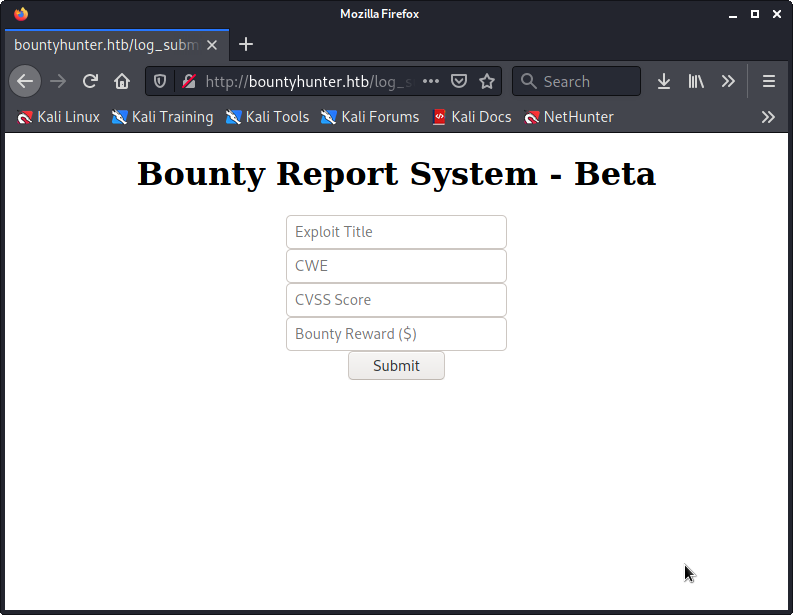
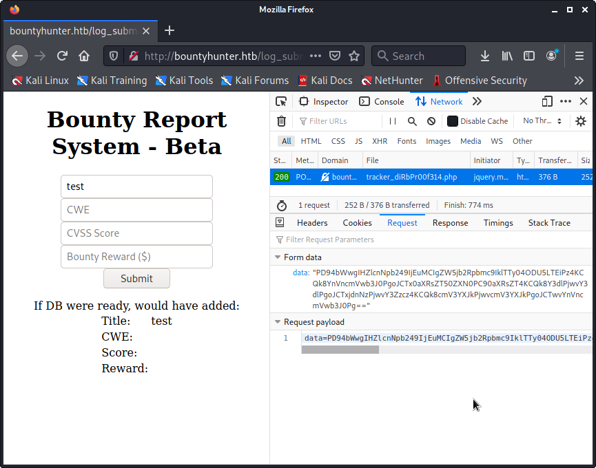
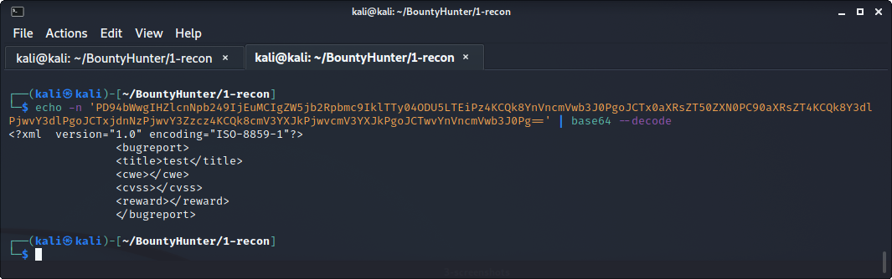
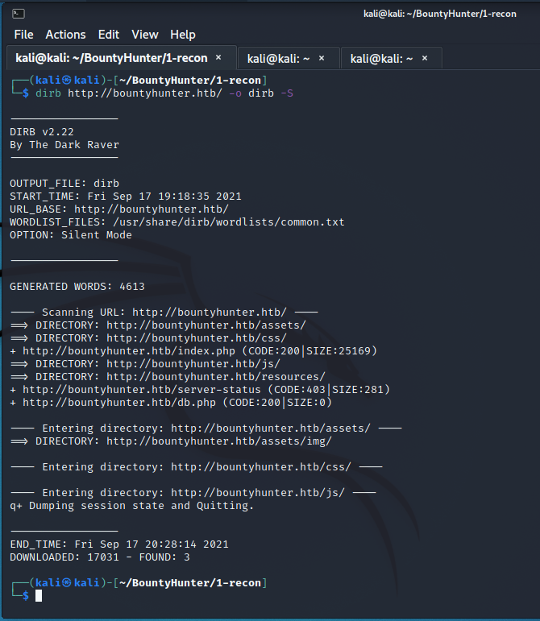
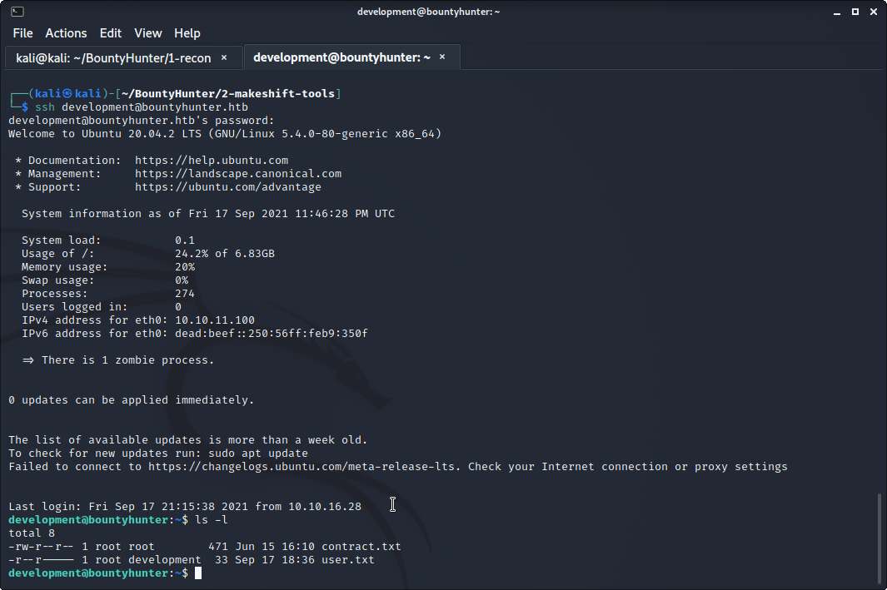
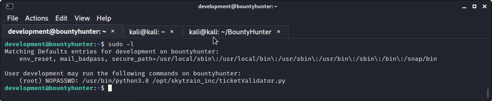
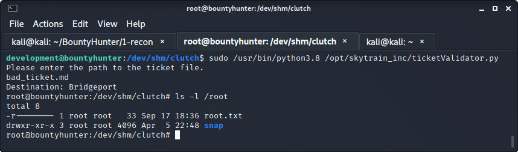

# HTB BountyHunter

### Enumeration
As with most, if not all htb machines, we add bountyhunter.htb to the hosts file on the attacking machine.



Initial scan with nmap shows ports 22 and 80 are open.

` nmap -Pn -p- -vv -sV -A -oA all-ports bountyhunter.htb`



Checking out port 80 shows us a Bounty Hunters splash page.



Head towards the portal link which leads to a page that accepts users input.



Place some test data in the title and checkout the request being sent.



An attacker can see that the data being passed to the server is base64 encoded.
Also notice the request is being sent to a page titled dirb-blahblah.
That's a powerful hint.
Bring out a scanner.

PERSONAL NOTE: I use a modified wordlist when I use dirb.
Using dirb may or may not find all necessary files.

While scanning, decode the data payload being sent to the victim.

` echo -n 'biglongpayload==' | base64 --decode`



Researching XML style attacks leads to XXE Injections.
An extensive list of things to try are located [here](
https://github.com/payloadbox/xxe-injection-payload-list 
"payloadbox").
Using one of the techniques listed there, an attacker is able to grab files off the victim.
They craft a special XML payload, encrypt it (base64 encoded, then url encoded), and send it to the victim server.
Here's an example.
```
<?xml version="1.0"?>
        <!DOCTYPE foo [
        <!ENTITY ac SYSTEM "php://filter/read=convert.base64-encode/resource=WhatEverFile.txt">]>
        <bugreport>
        <title>&ac;</title>
        </bugreport>
```
PERSONAL NOTE: I crafted a tool (log_submitter.py) that allowed me to quickly pick and pull specific files needed.



From dirb, an attacker can see `/resources/` and `/db.php`.
Directory `/resources/` shows the code of `log_submitter.php` and `/db.php` is a blank page.
An attacker can use the new XXE injection to view the "blank" `/db.php`.
A password is encoded with base64 in `db.php`.
That password can be used in conjuction with the user name in `/etc/passwd` to get ssh access.

### Foothold / User Flag

The user flag is there for the tagging once an attacker gains ssh access.



### Privilege Escalation

Once a foothold is gained to a unix machine, it's standard practice to check what sudo rights the user has.
The user has the ability to run a program called ticketValidator.py as root.
After taking a look at ticketValidator.py, it is clear that python function ` eval()` 
is being fed input that an attacker has control over.



Create or modify a ticket with a payload and execute ticketValidator.py with sudo.
Then grab the root flag.

