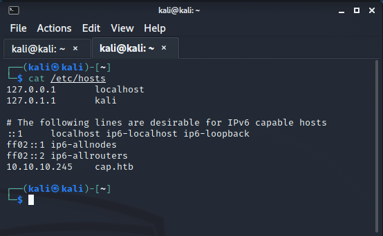
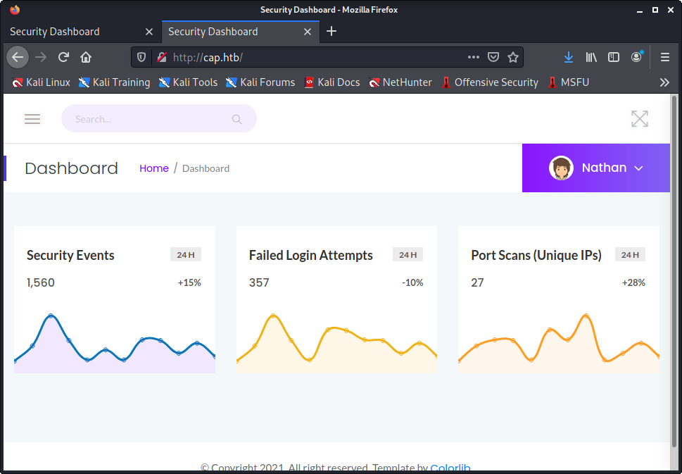
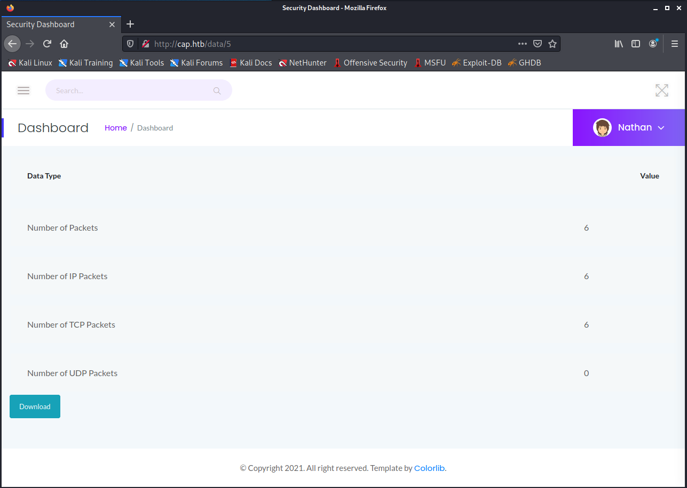
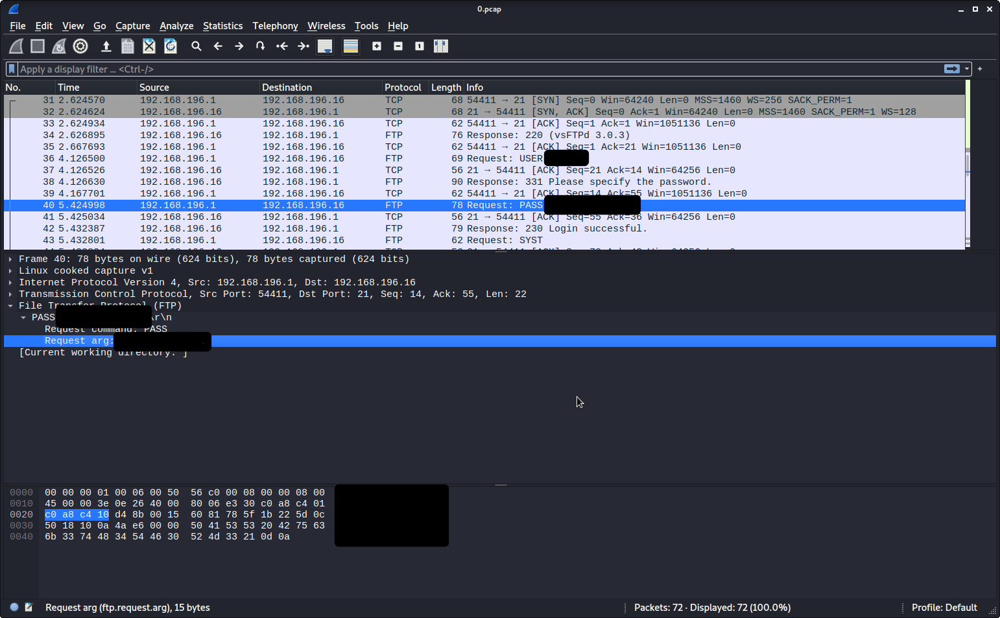
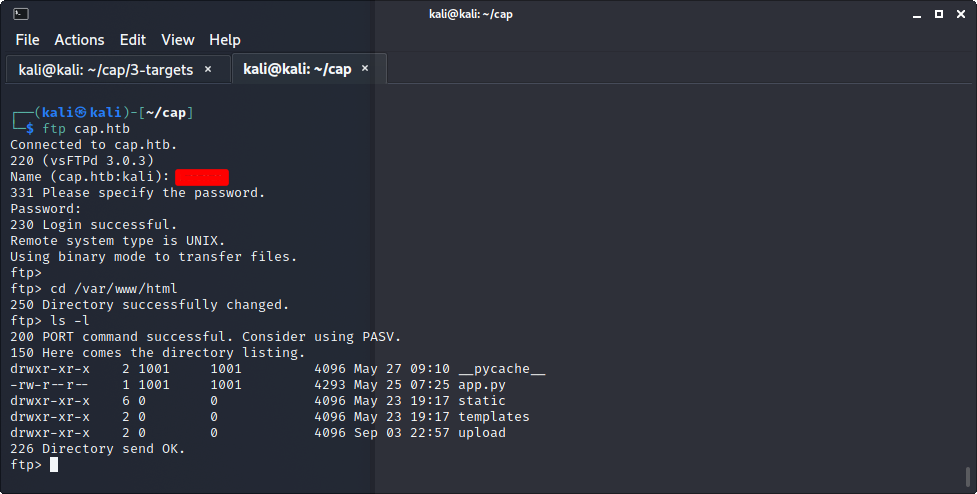
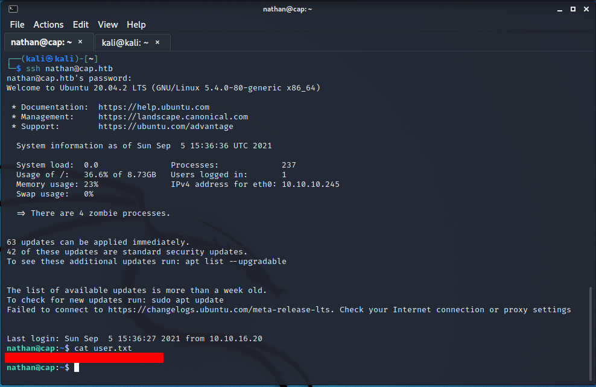
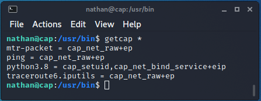
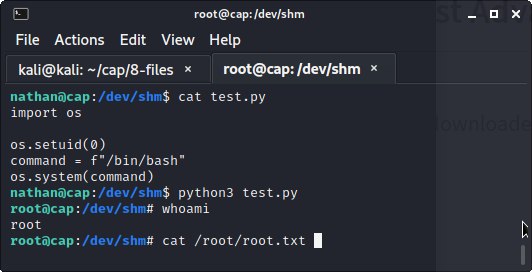

# HTB Cap

### Enumeration
As with most, if not all htb machines, we add cap.htb to the hosts file on the attacking machine.



Initial scan with nmap shows ports 21,22,80 open. 

` nmap cap.htb -sV -vv -Pn -A -oA all-ports -p-`


Scanning all ports (`-p-`) with nmap can take quite a while. Start looking at port 80 content.



Security Snapshot page discovered with the ability to download PCAP files.
The url in the screenshot shows `http://cap.htb/data/5` and when users click Download, they will download a 5.pcap file.
Users have the ability to control which pcap they download by changing the number in the url.



Change the value to 0 (`http://cap.htb/data/0`) to download the first pcap and view its contents with wireshark.
Username and password is exposed in plaintext from an earlier FTP transaction.



## Foothold
Transitioning into foothold stage.
Username and password are identical for FTP and SSH service.

FTP NOTE: Access to ftp on this server allows users to view more than the home directory.
So long as the user has permissions, they will be able to view anything starting from /.





## Privilege Escalation

Using either FTP or SSH, users can view the content of ` /var/www/html/app.py `.
In app.py, there are comments that provide a hint towards gaining root access.
```
# permissions issues with gunicorn and threads. hacky solution for now.
#os.setuid(0)
```
There are a couple ways to check for setuid type vulnerabilities.
Utilizing find (`find / -perm -u=s -type f 2>/dev/null`) to check for the setuid bit.
Another is checking Capabilities (`getcap /usr/bin/*`).



Seeing python with cap_setuid is a red flag. Because of the cap_setuid setting, a user will be able to create their own shell code and execute to obtain root.

