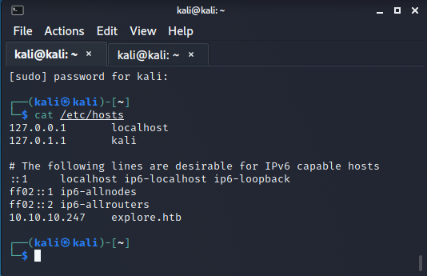
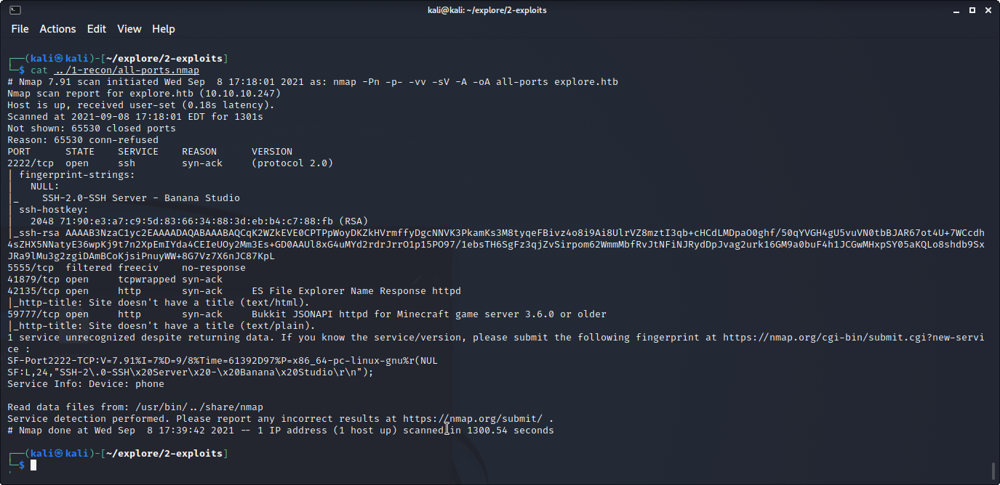
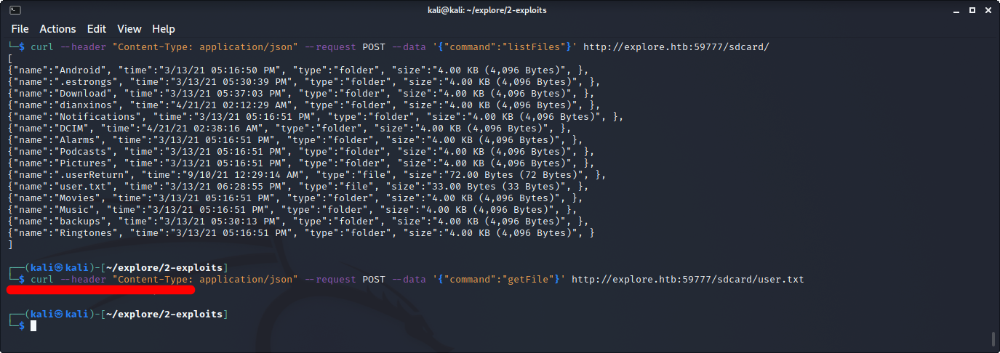
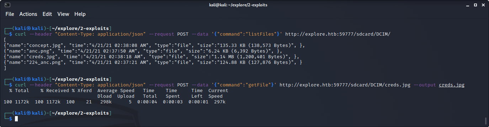
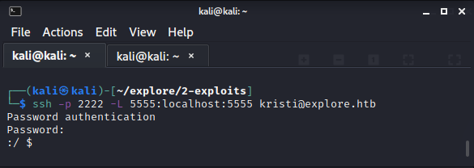
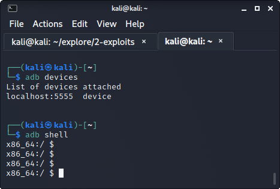

# HTB Explore

### Enumeration
As with most, if not all htb machines, we add explore.htb to the hosts file on the attacking machine.

Initial scan with nmap shows ports 2222, 41879, 42135, 59777 open and port 5555 filtered.

PORT NOTES: Port 2222 is showing an android ssh server.
Port 42135 is showing an android app called ES File Explorer.
Nmap thinks port 59777 is a Minecraft server which in fact is another port for ES File Explorer.
Port 5555 is the default port for adb (android debugging).

` nmap -Pn -p- -vv -sV -A -oA all-ports explore.htb`

Research into ES File Explorer shows a [metasploit auxiliary scanner](
    https://github.com/rapid7/metasploit-framework/blob/master/modules/auxiliary/scanner/http/es_file_explorer_open_port.rb
    "metasploit auxiliary scanner")
and a [POC written by fs0c131y](
    https://github.com/fs0c131y/ESFileExplorerOpenPortVuln
    "POC written by fs0c131y").
The idea is an attacker has access to a quite a few functions if port 59777 is exposed because of ES File Explorer.
Some of those functions are viewing files/directories, pulling files, starting applications, etc.
The POC written by fs0c131y' shows some great curl usage examples.

### Obtaining User.txt

Using the "listFiles" function, an attack can navigate through the directories.
Eventually, the attacker can locate and pull the user.txt file using the "getFile" function.

Step 1: `curl --header "Content-Type: application/json" --request POST --data '{"command":"listFiles"}' http://explore.htb:59777/sdcard/`

Step 2: `curl --header "Content-Type: application/json" --request POST --data '{"command":"getFile"}' http://explore.htb:59777/sdcard/user.txt`

### Foothold

Continuing to use the "listFiles" function, an image named "creds.jpg" can be found in /sdcard/DCIM/.
The image will reveal credentials used to SSH to port 2222.

### Privilege Escalation

From the initial scan, an attacker knows port 5555 is open.
As mentioned before, port 5555 is also the default port for adb (android debugging).
With ssh port forwarding, an attacker can connect via adb remotely.

SSH NOTES: SSH is great for pivotal attacks.
A user can attack specific ports to remote locations.
They can even mask their outgoing traffic to appear from a compromised host.
In this example, the attacker creates a tunnel listening to port 5555 on the attacker's localhost 
and sends traffic to localhost port 5555 on explore.htb.

In a different terminal, connect via adb.

Anyone who is familiar with rooting an android phone knows this step.
Try the ` su ` command to gain root access.
Unfortunately, with rooted android devices, security isn't the first though.
There is rarely password protection when accessing root.

